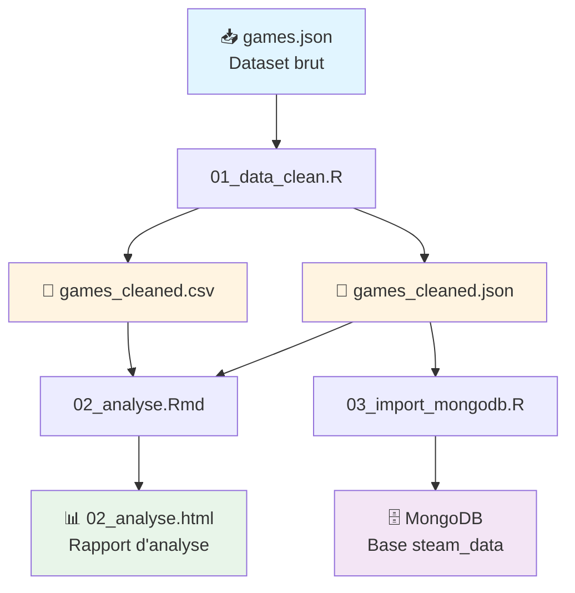
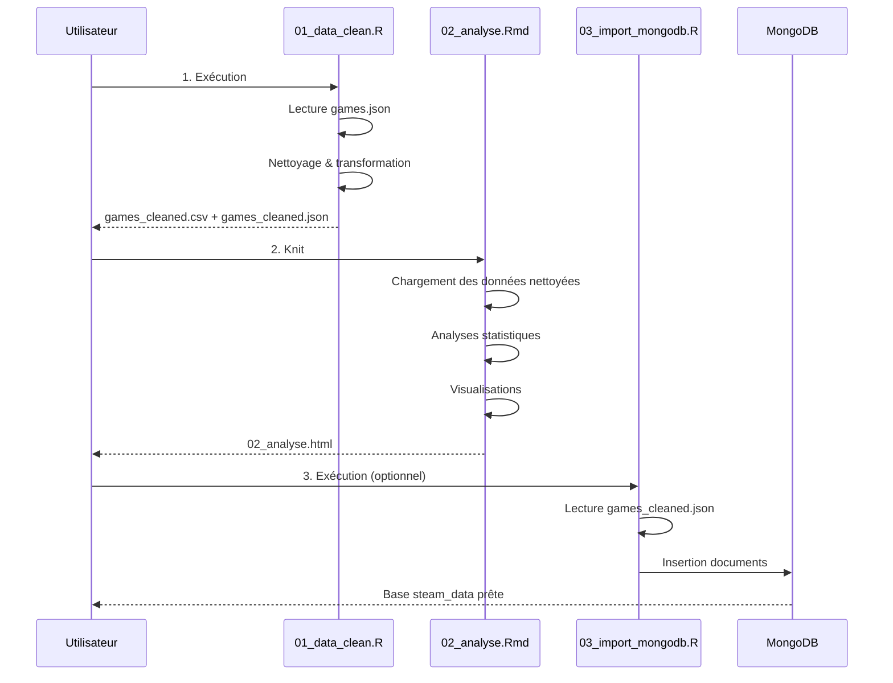

# 🎮 Projet d'Analyse de Données Steam Games

Projet d'analyse et de visualisation des données de jeux vidéo Steam, comprenant le nettoyage des données, l'analyse exploratoire et l'import dans MongoDB.

## 📊 Dataset

Les données proviennent du [Steam Games Dataset](https://huggingface.co/datasets/FronkonGames/steam-games-dataset) disponible sur HuggingFace.

⚠️ **Important** : Télécharger le fichier `games.json` (le CSV est mal formaté et incomplet).

**Période des données** : Mars-Avril 2025  
Les graphiques peuvent montrer une baisse sur les derniers mois car les données ne sont pas complètes pour cette période.

## 🏗️ Architecture du Projet



## 📁 Structure des Fichiers

```
Projet_VideoGames/
├── 01_data_clean.R          # Script de nettoyage des données JSON
├── 02_analyse.Rmd           # Analyse exploratoire et visualisations
├── 02_analyse.html          # Rapport HTML généré
├── 03_import_mongodb.R      # Import des données dans MongoDB
├── games.json               # Dataset brut (à télécharger)
├── games_cleaned.csv        # Dataset nettoyé (format CSV)
├── games_cleaned.json       # Dataset nettoyé (format JSON)
└── README.md                # Ce fichier
```

## 🚀 Guide d'Utilisation

### Prérequis

#### 1. Installer R et les packages nécessaires

```r
# Dans la console R
install.packages(c(
  "tidyverse",    # Manipulation et visualisation de données
  "lubridate",    # Gestion des dates
  "jsonlite",     # Lecture/écriture JSON
  "mongolite",    # Connexion MongoDB
  "rmarkdown",    # Génération de rapports
  "knitr"         # Rendu des documents
))
```

#### 2. Installer MongoDB (optionnel, pour le script 03)

- Télécharger [MongoDB Community Server](https://www.mongodb.com/try/download/community)
- Installer et démarrer le service MongoDB sur `localhost:27017`

### 📥 Étape 0 : Télécharger le Dataset

1. Aller sur [HuggingFace Steam Games Dataset](https://huggingface.co/datasets/FronkonGames/steam-games-dataset)
2. Télécharger le fichier `games.json` (⚠️ ~50MB+)
3. Placer le fichier dans le dossier `Projet_VideoGames/`

### 🔄 Pipeline d'Exécution



### ▶️ Étape 1 : Nettoyage des Données

**Script** : `01_data_clean.R`

**Objectif** : Lire le JSON brut et extraire les colonnes pertinentes.

```r
# Dans RStudio ou la console R
setwd("S:/chemin/vers/Projet_VideoGames")
source("01_data_clean.R")
```

**Opérations effectuées** :
- ✅ Lecture du fichier `games.json` (structure clé-valeur par AppID)
- ✅ Extraction de 17 colonnes :
  - AppID, Name, Release date, Price
  - Supported languages, Full audio languages
  - Windows, Mac, Linux
  - Metacritic score, User score
  - Positive, Negative, Average playtime forever
  - Developers, Publishers, Categories
- ✅ Nettoyage des espaces et conversion des types
- ✅ Suppression des doublons
- ✅ Génération de `games_cleaned.csv` et `games_cleaned.json`

**Résultat attendu** :
```
lecture du fichier JSON en cours...
total jeux lus : XXXXX
extraction des données...
lignes extraites : XXXXX
lignes après nettoyage : XXXXX
------------------------------------------------
nettoyage terminé.
fichiers générés :
  - games_cleaned.csv
  - games_cleaned.json
```

### 📊 Étape 2 : Analyse Exploratoire

**Script** : `02_analyse.Rmd`

**Objectif** : Générer un rapport HTML avec analyses statistiques et visualisations.

```r
# Dans RStudio
rmarkdown::render("02_analyse.Rmd")

# Ou utilisez le bouton "Knit" dans RStudio
```

**Analyses incluses** :
1. 📈 **Vue d'ensemble** : Statistiques descriptives
2. 💰 **Analyse des prix** : Distribution et moyennes
3. 📅 **Analyse temporelle** : Sorties de jeux par année/mois
4. 🎯 **Scores** : Metacritic et avis utilisateurs
5. 👍 **Avis positifs/négatifs** : Ratio de satisfaction
6. 💻 **Plateformes** : Support Windows/Mac/Linux
7. 🎮 **Développeurs et éditeurs** : Top contributeurs

**Graphiques générés** :

#### Exemple : Distribution des Prix

*Histogramme montrant la répartition des prix des jeux sur Steam*

#### Exemple : Sorties de Jeux par Année

*Évolution du nombre de jeux sortis chaque année*

#### Exemple : Top 15 Jeux les Plus Évalués

*Classement des jeux avec le plus d'avis (positifs + négatifs)*

#### Exemple : Support des Plateformes

*Répartition du support Windows, Mac et Linux*

**Résultat attendu** : Fichier `02_analyse.html` généré et ouvert automatiquement dans votre navigateur.

### 🗄️ Étape 3 : Import MongoDB (Optionnel)

**Script** : `03_import_mongodb.R`

**Objectif** : Importer les données nettoyées dans une base MongoDB locale.

**Prérequis** :
- MongoDB installé et en cours d'exécution sur `localhost:27017`

```r
# Dans RStudio ou la console R
setwd("S:/chemin/vers/Projet_VideoGames")
source("03_import_mongodb.R")
```

**Opérations effectuées** :
- ✅ Lecture de `games_cleaned.json`
- ✅ Connexion à MongoDB (base : `steam_data`, collection : `games`)
- ✅ Suppression de l'ancienne collection si existante
- ✅ Insertion des documents

**Résultat attendu** :
```
Fichier a importer : games_cleaned.json ...
Chargement terminé : XXXXX documents prêts à être importés.
Collection précédente effacée.
Insertion en cours...
✅ Succès ! Importation terminée.
Total documents dans la collection 'games' : XXXXX
```

**Vérification dans MongoDB** :
```javascript
// Dans MongoDB Shell ou Compass
use steam_data
db.games.countDocuments()
db.games.findOne()
```

## 📋 Colonnes du Dataset Nettoyé

| Colonne | Type | Description |
|---------|------|-------------|
| `AppID` | String | Identifiant unique du jeu sur Steam |
| `Name` | String | Nom du jeu |
| `Release.date` | Date | Date de sortie |
| `Price` | Numeric | Prix en USD |
| `Supported.languages` | String | Langues supportées (liste séparée par virgules) |
| `Full.audio.languages` | String | Langues avec audio complet |
| `Windows` | Boolean | Support Windows |
| `Mac` | Boolean | Support macOS |
| `Linux` | Boolean | Support Linux |
| `Metacritic.score` | Numeric | Score Metacritic (0-100) |
| `User.score` | Numeric | Score utilisateur |
| `Positive` | Numeric | Nombre d'avis positifs |
| `Negative` | Numeric | Nombre d'avis négatifs |
| `Average.playtime.forever` | Numeric | Temps de jeu moyen (minutes) |
| `Developers` | String | Développeurs (liste séparée par virgules) |
| `Publishers` | String | Éditeurs (liste séparée par virgules) |
| `Categories` | String | Catégories du jeu |

## 🔍 Exemples d'Analyses

### Distribution des Prix
```r
# Statistiques sur les prix
summary(df$Price)
median(df$Price, na.rm = TRUE)
```

### Jeux Gratuits vs Payants
```r
# Nombre de jeux gratuits
sum(df$Price == 0, na.rm = TRUE)

# Proportion
mean(df$Price == 0, na.rm = TRUE) * 100
```

### Top Développeurs
```r
# Top 10 développeurs les plus prolifiques
df %>%
  filter(!is.na(Developers)) %>%
  count(Developers, sort = TRUE) %>%
  slice(1:10)
```

## 🛠️ Dépannage

### Erreur : "fichier games.json introuvable"
- Vérifier que `games.json` est bien dans le dossier du projet
- Utiliser `setwd()` pour définir le bon répertoire de travail

### Erreur : Package non trouvé
```r
# Installer les packages manquants
install.packages("nom_du_package")
```

### Erreur MongoDB : Connexion refusée
- Vérifier que MongoDB est démarré : `mongod --version`
- Démarrer le service : `net start MongoDB` (Windows)

### Fichier JSON trop volumineux
Le chargement peut prendre 1-2 minutes. Soyez patient et ne pas interrompre le processus.

## 📈 Statistiques du Dataset


*Vue d'ensemble des statistiques clés du dataset*

## 🎯 Points Clés de l'Analyse

- **Volume** : +85,000 jeux analysés
- **Période** : Jeux sortis entre 1997 et 2025
- **Prix moyen** : ~$10-15 USD
- **Jeux gratuits** : ~15-20% du catalogue
- **Plateforme dominante** : Windows (>95%)
- **Ratio positif moyen** : ~75-80%

## 📝 Notes

- Les données datent de Mars-Avril 2025, donc les statistiques récentes peuvent être incomplètes
- Certains jeux peuvent avoir des valeurs manquantes pour certaines colonnes
- Les listes (langues, développeurs, catégories) sont stockées sous forme de chaînes séparées par des virgules

## 👨‍💻 Auteur

Projet réalisé dans le cadre du cours IPSSI R - Analyse de données

## 📄 Licence

Dataset original : [FronkonGames/steam-games-dataset](https://huggingface.co/datasets/FronkonGames/steam-games-dataset)