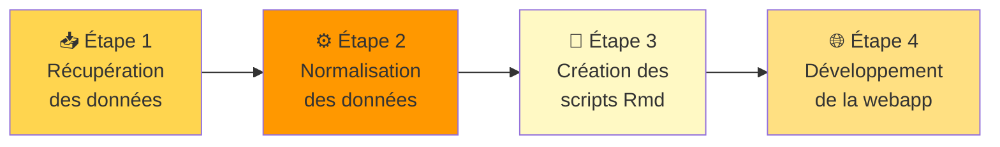
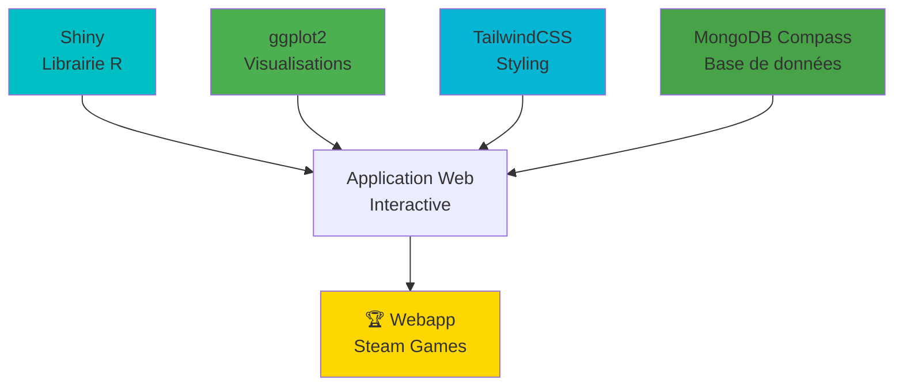

# 🎮 Projet d'Analyse de Données Steam Games

> **IPSSI 2025/2026** - Présentation Technologies R

Projet d'analyse et de visualisation des données de jeux vidéo Steam, comprenant le nettoyage des données, l'analyse exploratoire et l'import dans MongoDB.

## 🛠️ Stack Technologique

| Technologie | Description | Usage |
|-------------|-------------|-------|
|  | Langage de programmation dédié aux statistiques et à la data-science | Traitement et analyse des données |
|  | Package R permettant de transformer en applications web interactives | *(Étape 4 - Webapp)* |
|  | Base de données NoSQL, stockant les données en local ou cloud | Persistance des données |
|  | Collection de packages pour manipulation et la visualisation de données | Nettoyage et analyse |

## 📊 Dataset

Les données proviennent du [Steam Games Dataset](https://huggingface.co/datasets/FronkonGames/steam-games-dataset) disponible sur HuggingFace.

⚠️ **Important** : Télécharger le fichier `games.json` (le CSV est mal formaté et incomplet).

**Période des données** : Mars-Avril 2025  
Les graphiques peuvent montrer une baisse sur les derniers mois car les données ne sont pas complètes pour cette période.

## 🏗️ Pipeline du Projet

Le projet suit un workflow en 4 étapes principales :



### Détails des Étapes

1. **Récupération des données** : Téléchargement du dataset depuis HuggingFace
2. **Normalisation** : Nettoyage et transformation avec `01_data_clean.R`
3. **Analyses** : Création du rapport d'analyse avec `02_analyse.Rmd`
4. **Webapp** : Développement d'une application Shiny interactive *(optionnel)*

## 📁 Structure des Fichiers

```
Projet_VideoGames/
├── 01_data_clean.R          # Script de nettoyage des données JSON
├── 02_analyse.Rmd           # Analyse exploratoire et visualisations
├── 02_analyse.html          # Rapport HTML généré
├── 03_import_mongodb.R      # Import des données dans MongoDB
├── games.json               # Dataset brut (à télécharger)
├── games_cleaned.csv        # Dataset nettoyé (format CSV)
├── games_cleaned.json       # Dataset nettoyé (format JSON)
└── README.md                # Ce fichier
```

## 🚀 Guide d'Utilisation

### Prérequis

#### 1. Installer RStudio

- Télécharger [RStudio Desktop](https://posit.co/download/rstudio-desktop/)
- Installer R (inclus avec RStudio)

#### 2. Installer les packages R nécessaires

**Ouvrir RStudio** et exécuter dans la console :

```r
install.packages(c(
  "tidyverse",    # Manipulation et visualisation de données
  "lubridate",    # Gestion des dates
  "jsonlite",     # Lecture/écriture JSON
  "mongolite",    # Connexion MongoDB
  "rmarkdown",    # Génération de rapports
  "knitr"         # Rendu des documents
))
```

#### 3. Installer MongoDB (optionnel, pour le script 03)

- Télécharger [MongoDB Community Server](https://www.mongodb.com/try/download/community)
- Installer et démarrer le service MongoDB sur `localhost:27017`

### 📥 Étape 0 : Télécharger le Dataset

1. Aller sur [HuggingFace Steam Games Dataset](https://huggingface.co/datasets/FronkonGames/steam-games-dataset)
2. Cliquer sur **"Files and versions"**
3. Télécharger le fichier **`games.json`** (⚠️ ~700MB, peut prendre un moment)
   1. ou utiliser les fichier déjà clean inclu dans le repo
4. Placer le fichier dans le dossier `Projet_VideoGames/`

---

## 📋 Pipeline d'Exécution Détaillé

### ▶️ Étape 1 : Nettoyage des Données

**Fichier** : `01_data_clean.R`

**Objectif** : Filtrer et nettoyer le dataset JSON brut

#### 🎯 Colonnes Extraites

Le script extrait 17 colonnes pertinentes depuis le JSON :

| Colonne | Description |
|---------|-------------|
| `AppID` | Identifiant unique Steam |
| `Name` | Nom du jeu |
| `Release date` | Date de sortie |
| `Price` | Prix en USD |
| `Supported languages` | Langues supportées |
| `Full audio languages` | Langues avec doublage |
| `Windows` / `Mac` / `Linux` | Support des plateformes |
| `Metacritic score` | Score critique (0-100) |
| `User score` | Note utilisateurs |
| `Positive` / `Negative` | Nombre d'avis |
| `Average playtime forever` | Temps de jeu moyen |
| `Developers` | Studios développeurs |
| `Publishers` | Éditeurs |
| `Categories` | Catégories du jeu |

#### 🔧 Opérations de Nettoyage

1. **Lecture du JSON** avec `jsonlite` (structure clé-valeur par AppID)
2. **Conversion des champs multiples** (listes → strings avec virgules)
3. **Retrait des NA** et valeurs manquantes
4. **Changement du format de la date** avec `lubridate`
5. **Export en CSV et JSON nettoyés**

#### ⌨️ Exécution dans RStudio

1. **Ouvrir le fichier** `01_data_clean.R` dans RStudio
2. **Appuyer sur `Ctrl + Shift + R`** (Windows) ou `Cmd + Shift + R` (Mac)
   - Cette combinaison exécute tout le script R
3. **Attendre la fin du traitement** (1-2 minutes selon votre machine)

#### ✅ Résultat

Deux fichiers sont générés :
- **`games_cleaned.csv`** : Format tabulaire (~110k jeux)
- **`games_cleaned.json`** : Format structuré pour MongoDB

---

### 📊 Étape 2 : Analyse Exploratoire et Visualisations

**Fichier** : `02_analyse.Rmd`

**Objectif** : Générer un rapport HTML interactif avec analyses statistiques et graphiques

#### 📈 Types d'Analyses Réalisées

##### 1️⃣ Analyse Économiques
- Distribution des prix (histogramme, box plot)
- Évolution temporelle (nombre de jeux/année)
- Visualisation de la segmentation tarifaire du marché

##### 2️⃣ Engagement & Popularité
- Ratio avis positifs/négatifs
- Temps de jeu moyen par catégorie
- Top développeurs/éditeurs

##### 3️⃣ Analyse Qualitative
- Distribution Metacritic vs User Score
- Corrélation entre sources de notes

##### 4️⃣ Tendances & Segments
- Évolution multi-plateforme
- **Prix vs Qualité vs Playtime**
- Catégories dominantes

#### 💡 Exemple d'Insight : Corrélation Prix/Qualité

**Hypothèse testée** : Les jeux chers sont mieux notés

**Résultats** :
- Jeux 0-10€ : Score moyen **62/100**
- Jeux 50€+ : Score moyen **80/100**
- **Différence : +18 points (+23%)**

**Conclusion** : Corrélation prix/qualité confirmée ✅

#### ⌨️ Exécution dans RStudio

1. **Ouvrir le fichier** `02_analyse.Rmd` dans RStudio
2. **Appuyer sur `Ctrl + Shift + K`** (Windows) ou `Cmd + Shift + K` (Mac)
   - Cette combinaison **compile le RMarkdown** et génère le HTML
3. **Attendre le rendu** (30-60 secondes)
4. **Le fichier HTML s'ouvre automatiquement** dans votre navigateur

#### ✅ Résultat

Fichier **`02_analyse.html`** généré avec :
- Génération d'un rapport html
- Identification patterns et insights
- Visualisation avec ggplot2

---

### 🗄️ Étape 3 : Import MongoDB (Optionnel)

**Fichier** : `03_import_mongodb.R`

**Objectif** : Importer les données nettoyées dans une base MongoDB locale

#### 🔧 Opérations effectuées

1. **Suppression des anciennes données** de la BDD
2. **Chargement** de `game_cleaned.csv` dans un DataFrame R
3. **Connexion et insertion** des données dans MongoDB (avec `mongolite`)
4. **Nom des colonnes automatiques** à l'aide du CSV
5. **Prise en charge des gestion d'erreur** (exemple : serveur MongoDB non lancé)

#### ⌨️ Exécution dans RStudio

1. **Démarrer MongoDB** localement

2. **Ouvrir le fichier** `03_import_mongodb.R` dans RStudio

3. **Appuyer sur `Ctrl + Shift + R`** pour exécuter


#### ✅ Vérification dans MongoDB

**Avec MongoDB Compass** (interface graphique) :
1. Ouvrir Compass
2. Se connecter à `mongodb://localhost:27017`
3. Base : `steam_data` → Collection : `games`

**Rendu visuel MongoDB Compass** :

La collection contient maintenant tous les jeux avec leur structure JSON complète, incluant tous les champs nettoyés.

---

## ⌨️ Raccourcis RStudio Essentiels

| Raccourci | Action | Usage |
|-----------|--------|-------|
| **`Ctrl + Shift + R`** | Exécuter tout le script R | Pour les fichiers `.R` |
| **`Ctrl + Shift + K`** | Knit (compiler) le document | Pour les fichiers `.Rmd` → génère HTML |
| `Ctrl + Enter` | Exécuter la ligne courante | Exécution ligne par ligne |
| `Ctrl + Shift + C` | Commenter/décommenter | Toggle commentaire |
| `Ctrl + L` | Effacer la console | Nettoyer l'affichage |

---

## 🎯 Projet Webapp Shiny (Étape 4)

### Technologies Stack



### Pages de l'application

1. **Accueil** : Vue d'ensemble du dataset
2. **Données & Filtres** : Exploration interactive avec filtres dynamiques
3. **Graphiques & Analyses** : Visualisations interactives (histogrammes, scatter plots)
4. **Ajouter un jeu** : Formulaire d'insertion dans MongoDB

### Technologies utilisées

- **Shiny** (librairie R) : Framework web interactif
- **Ggplot2** : Graphiques et visualisations
- **TailwindCSS** : Styling moderne et responsive
- **MongoDB Compass** : Interface de gestion de la base de données

*Cette étape est optionnelle et fait partie d'un projet étendu.*

---

## 📈 Exemples de Visualisations Générées

### Distribution des Scores Metacritic


*Histogramme montrant la distribution des scores Metacritic. On observe une concentration autour de 70-80 points, indiquant que la majorité des jeux évalués sont de bonne qualité.*

---

## 📋 Structure Complète des Fichiers

```
Projet_VideoGames/
├── 📄 01_data_clean.R          # Script de nettoyage JSON → CSV/JSON
├── 📄 02_analyse.Rmd           # RMarkdown d'analyse exploratoire
├── 📊 02_analyse.html          # Rapport HTML généré (à ouvrir)
├── 📄 03_import_mongodb.R      # Script d'import MongoDB
├── 📥 games.json               # Dataset brut HuggingFace (à télécharger)
├── ✅ games_cleaned.csv        # Dataset nettoyé (format CSV)
├── ✅ games_cleaned.json       # Dataset nettoyé (format JSON)
├── 📁 images/                  # Captures d'écran des graphiques
└── 📖 README.md                # Ce fichier
```


### ⏱️ Chargement JSON très long

**C'est normal !** Le fichier `games.json` fait ~85MB avec 85k+ jeux.
- Temps de chargement : 1-2 minutes
- Ne pas interrompre le processus
- Vérifier la console R pour voir la progression

---

## 🎓 Compétences Développées

- ✅ Manipulation de données avec **tidyverse** (dplyr, ggplot2)
- ✅ Traitement de fichiers **JSON** volumineux
- ✅ Gestion des dates avec **lubridate**
- ✅ Création de rapports avec **RMarkdown**
- ✅ Connexion et requêtes **MongoDB** avec mongolite
- ✅ Analyse exploratoire de données (EDA)
- ✅ Visualisation de données avec **ggplot2**
- ✅ Nettoyage et transformation de datasets réels

---

## 📝 Notes Importantes

- ⚠️ Les données datent de **Mars-Avril 2025**, les statistiques récentes peuvent être incomplètes
- 🔢 Certains jeux ont des valeurs **NA** (manquantes) pour certains champs
- 📋 Les listes (langues, développeurs, catégories) sont stockées en **chaînes séparées par des virgules**
- 🎮 Les jeux sans nom ou AppID invalide sont **automatiquement exclus**

---

## 📄 Crédits

- **Dataset original** : [FronkonGames/steam-games-dataset](https://huggingface.co/datasets/FronkonGames/steam-games-dataset)
**Projet réalisé dans le cadre du cours IPSSI R - Analyse de données**  
📅 Année universitaire 2025/2026

- Matis
- Julien
- Carl